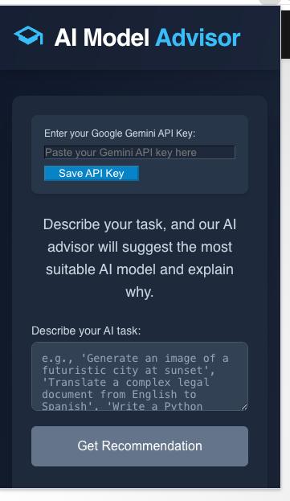
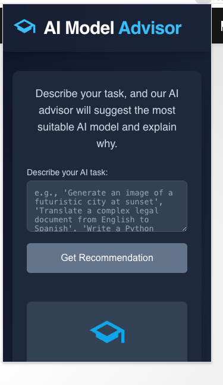
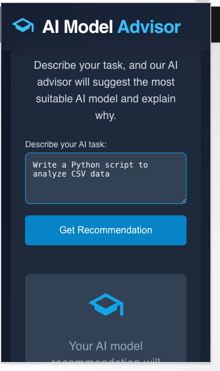
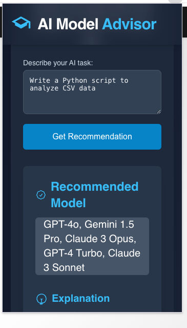
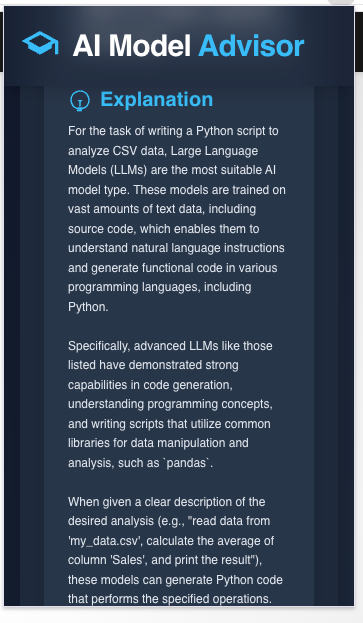

# AI Model Advisor

AI Model Advisor is a web app that helps you choose the most suitable AI model for your specific task. Powered by Google Gemini, it provides clear recommendations and detailed explanations for a wide range of AI tasks.

---

## 🚀 What is AI Model Advisor?

AI Model Advisor is designed to answer the question:  
**"Which AI model should I use for my task?"**

- **Describe your AI task** (e.g., "Generate an image of a futuristic city at sunset", "Translate a legal document", "Write a Python script to analyze CSV data").
- The app **analyzes your description** and suggests the most relevant AI models (e.g., Gemini, GPT-4o, Claude 3, DALL-E 3, etc.).
- You get a **clear recommendation** and a **detailed explanation** of why those models are suitable.

---

## 🖥️ How it Works

1. **Enter your task** in the input box.
2. Click **"Get Recommendation"**.
3. The app consults Google Gemini and displays:
   - A list of recommended AI models.
   - An explanation tailored to your task.

### Example Screenshots

| Task Input | Model Recommendation |
|------------|---------------------|
|  |  |
|  |  |

---

## 🛠️ Local Setup Instructions

**Prerequisites:**  
- [Node.js](https://nodejs.org/) (v16+ recommended)
- A [Google Gemini API Key](https://aistudio.google.com/app/apikey)

### 1. Clone the repository

```sh
git clone https://github.com/your-username/ai-model-advisor.git
cd ai-model-advisor
```

### 2. Install dependencies

```sh
npm install
```

### 3. Configure your Gemini API key

- Copy your Gemini API key.
- Open or create the file `.env.local` in the project root.
- Add the following line (replace with your actual key):

```
GEMINI_API_KEY=your_actual_gemini_api_key_here
```

### 4. Run the app locally

```sh
npm run dev
```

- Open [http://localhost:5173](http://localhost:5173) in your browser.

---

## 💡 Idea Behind the Project

Choosing the right AI model can be confusing with so many options available.  
**AI Model Advisor** simplifies this by leveraging the latest AI (Google Gemini) to recommend the best models for your needs, whether it's text, image, code, or other AI tasks.

---

## 🧩 Chrome Extension

A Chrome Extension version is now available!  
- Get AI model recommendations directly in your browser, on any page.
- Extension screenshots are in the `output-images/` folder.

### How to Load the Extension in Chrome

1. **Switch to the `chrome-extension` branch:**
   ```sh
   git checkout chrome-extension
   ```

2. **Build or prepare the extension files:**
   - The extension source code is in the `extension/` folder.
   - Make sure all files are present in `extension/`.

3. **Load the extension in Chrome:**
   - Open Chrome and go to `chrome://extensions/`.
   - Enable **Developer mode** (toggle in the top right).
   - Click **Load unpacked**.
   - Select the `extension/` folder from this repository.

4. **Configure your Gemini API key:**
   - Open the extension’s popup (click the extension icon in Chrome).
   - Enter your Gemini API key in the settings or prompt (see extension UI).
   - The extension will store your key locally (never sent to anyone except Gemini API).

5. **Using the Extension:**
   - Highlight or type your AI task on any webpage, or use the extension popup.
   - Click **"Get Recommendation"** in the extension.
   - Instantly see recommended AI models and explanations, just like the web app.

### Extension Screenshots

See example screenshots in the [`output-images/`](output-images/) folder:
- `output-images/extension-*.png` show the extension in action.


### Example Screenshots

| Task Input | Model Recommendation |
|------------|---------------------|
|  |  |
|  |   |

---

## 📸 Screenshots

You can find all screenshots in the [`output-images/`](output-images/) folder.

---

## 📝 License & Disclaimer

- **Disclaimer:** Recommendations are AI-generated and for informational purposes only.
- See [LICENSE](LICENSE) for details (add a license file if needed).

---

**

Made with ❤️ by 

[Baby Manisha Sunkara](https://babymanisha.com)

**
